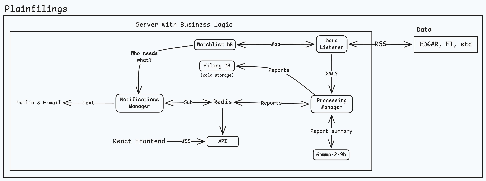

# Plainfilings

En software-as-a-service tjänst som skall ge användare direkt data från finansiella rapporter världen över.

### Mål med strukturen

Målet med detta projekt är att göra en demonstration av latens, och dess påverkan på större delar av ett system. Alltså att kartlägga latensen i varje steg, och visualisera detta och lagra resultaten som historik.

